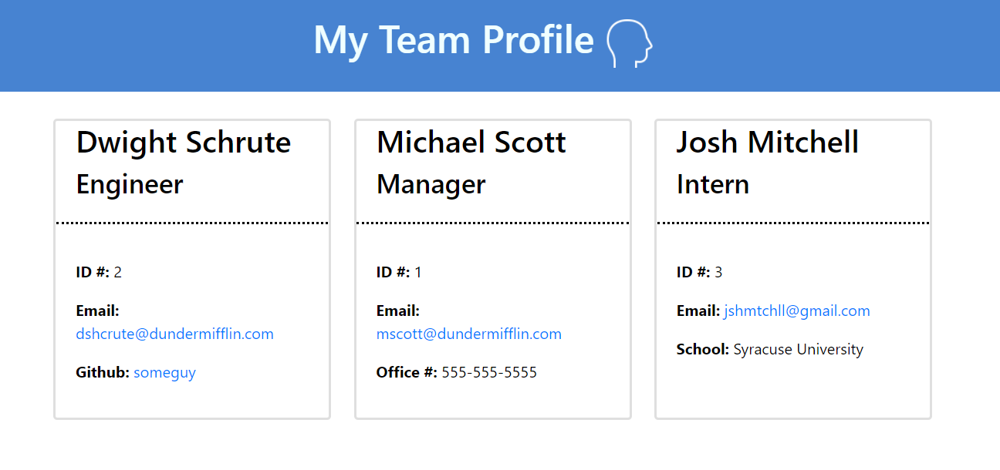

# Team Profile Generator: ES6+ and Node.js

## Description 
  
This is a command-line application that runs with Node.js that dynamically generates a HTML file based on input about your team

## Installation

1. Run `npm install inquirer` in order to install the inquirer package to prompt user for input

2. Make sure you are in the root folder

3. The application itself can be invoked by running `node index` in terminal

## Usage 

(click for video)

When you run `node index.js`, the application uses the `inquirer` package to prompt you in the command line with a series of questions about your GitHub and about your project.

The application then takes the user responses and writes a html to the `dist` directory  using `fs.writeFile` including the responses the user put in the prompts 

## Questions?

GitHub: [@jshmtchll](https://api.github.com/users/jshmtchll)

Email: jshmtchll@gmail.com